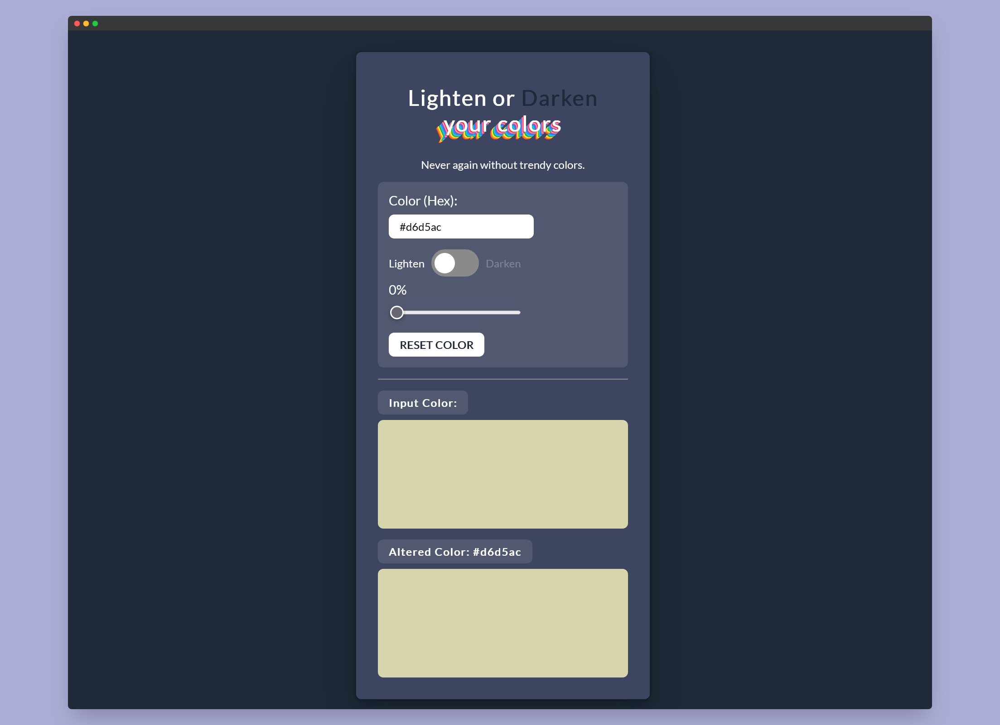

# Scrimba - Javascript color tool solution

This is a solution to the [Javascript color tool project on Scrimba](https://scrimba.com/learn/learnjavascript/). Scrimba helps you improve your coding skills by building realistic projects.

## Table of contents

- [Overview](#overview)
  - [The challenge](#the-challenge)
  - [Screenshot](#screenshot)
  - [Links](#links)
- [My process](#my-process)
  - [Built with](#built-with)
  - [What I learned](#what-i-learned)
  - [Continued development](#continued-development)
  - [Useful resources](#useful-resources)
- [Author](#author)
- [Acknowledgments](#acknowledgments)

## Overview

### The challenge

Users should be able to:

- Insert an hex color of 3 or 6 characters
- Choose if lighten or darken the input color by clicking on toggle
- Drag the slider to choose how to lighten/darken the input color
- Reset colors clicking on reset button
- See altered color in real time
- See hover states for interactive elements

### Screenshot



### Links

- Solution URL: [@GitHub](https://github.com/xdelmo/JS-color-tool)
- Live Site URL: [@GitHub](https://htmlpreview.github.io/?https://github.com/xdelmo/JS-color-tool/blob/master/index.html)

## My process

### Built with

- Semantic HTML5 markup
- CSS custom properties
- Flexbox
- Mobile-first workflow
- Vanilla Javascript

### What I learned

With this project I improved a lot my JS skills, learning new methods and way to manipulate the DOM. The newest things I learnt are:

- How to check if an HTML has a certain class and modify others elements

```css
/* If an element with class .toggle-btn has even .toggled as class, selects siblings with .inner-circle class */
.toggle-btn.toggled > .inner-circle {
  transform: translateX(30px);
  background-color: var(--clr-blue-very-dark);
}
```

- How to work and handle numbers (or strings) with different radix

```js
// The substring() method extracts characters, between two indices (positions), from a string, and returns the substring.
// The substring() method extracts characters from start to end (exclusive=end not included).
// parseInt() converts a string into an integer of the specified radix: in this case 16
const r = parseInt(strippedHex.substring(0, 2), 16);
const g = parseInt(strippedHex.substring(2, 4), 16);
const b = parseInt(strippedHex.substring(4, 6), 16);
// return object like this: {r: 255, g: 255, b: 255}
return { r, g, b };
```

### Continued development

I'd like to:

- Add a random color generator
- Implement the ability to 1-click copy altered colors
- Make UI screen-responsive

### Useful resources

- [MDN Web Docs](https://developer.mozilla.org/en-US/) - An open-source, collaborative project documenting Web platform technologies with extensive set of learning resources
  [Document: keyup event](https://developer.mozilla.org/en-US/docs/Web/API/Document/keyup_event)
  [parseInt()](https://developer.mozilla.org/en-US/docs/Web/JavaScript/Reference/Global_Objects/parseInt?retiredLocale=it)

- [W3Schools](https://www.w3schools.com/) - One of the best sources to learn new things
  [replace()](https://www.w3schools.com/jsref/jsref_replace.asp)
  [substring()](https://www.w3schools.com/jsref/jsref_substring.asp)
  [toString()](https://www.w3schools.com/jsref/jsref_tostring_number.asp)
  [toggleSwitch](https://www.w3schools.com/howto/howto_css_switch.asp)

## Author

- Website - [Emanuele Del Monte](https://www.emanueledelmonte.it)

## Acknowledgments

A big thank you to [James Q Quick](https://github.com/jamesqquick) who is on superior Javascript level 👏
